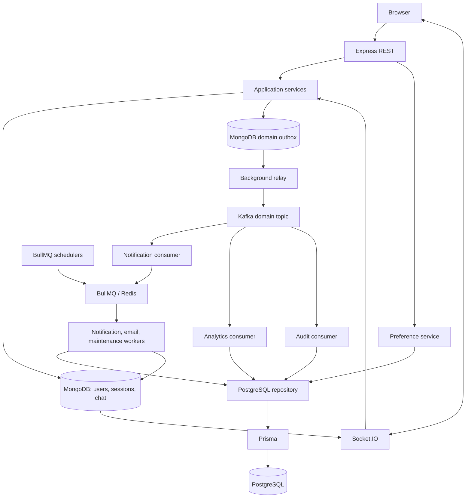

# Let's Talk

Let's Talk is an existing real-time community chat application, incrementally extended with asynchronous backend processing. Express serves REST endpoints and a modular vanilla JavaScript frontend. There is no frontend build step. Existing authentication, MongoDB sessions, rooms, roles, invitations, DMs, unread tracking, replies, reactions, editing, deletion, presence, typing, WebRTC signaling, profiles, and Cloudinary avatars remain.

## Architecture



The API and background runner are two Node.js processes in one repository. `npm run workers` starts the relay, consumer groups, workers, and schedule registration together. Individual role commands exist for learning/debugging; this is not a microservices deployment.

## Technologies and data ownership

| Component | Responsibility |
| --- | --- |
| JavaScript / Node.js 22 | CommonJS; async/await for I/O and higher-order functions for correlation and processor registration |
| MongoDB / Mongoose | Users, authentication, sessions, Messages, DirectMessages, DirectConversations, Rooms, membership, reactions, replies, read state, and activity |
| PostgreSQL / Prisma 6.19 | Relational identity references, preferences, notifications, audits, email delivery tracking, aggregates, and processing deduplication |
| Socket.IO | Existing client-facing real-time events and WebRTC signaling |
| Kafka / KafkaJS | Durable asynchronous backend event distribution |
| Redis | BullMQ queue storage; local AOF persistence with `noeviction` |
| BullMQ | Retried background jobs, retained failures, and recurring scheduling |
| Cloudinary | Existing avatar provider; optional for local chat startup |

Redis does not store message history. Prisma never accesses MongoDB. Mongoose never accesses PostgreSQL. Kafka does not carry typing, presence, or WebRTC packets.

### Relational models

`UserAccount.mongoUserId` uniquely references the existing MongoDB identity; it contains no password, email, or duplicated profile. Accounts are created lazily for existing users and through analytics for newly registered users.

`NotificationPreference` has a one-to-one foreign key to UserAccount. DM notifications default on; room notifications, email, and digest default off. `AuditLog` has an actor foreign key, unique event ID, action, entity reference, identifier-only metadata, and occurrence time.

`Notification` has a 30-day expiry. `EmailDelivery` stores pending provider requests for identical retries; once accepted, its status becomes `sent` and its payload is replaced with the provider receipt. Pending requests include the recipient and email content: restrict database access accordingly. `DailyMetric` counts supported events by UTC day. `ProcessedEvent` transactionally deduplicates PostgreSQL effects.

See [schema](prisma/schema.prisma) and [initial migration](prisma/migrations/20260910000000_relational_domain/migration.sql).

## Local development

Requirements: Node.js 22, npm, Docker Desktop running Linux containers, and available ports 27017, 5432, 6379, and 9092. Containers bind to localhost. Kafka uses single-node KRaft without ZooKeeper.

Keep your existing `.env`. For a new checkout only:

```powershell
Copy-Item .env.example .env
```

Set a random `SESSION_SECRET`. For existing installations, add new variables from the example without replacing your existing MongoDB/Cloudinary settings. To use Docker MongoDB, explicitly set `MONGO_URI=mongodb://127.0.0.1:27017/letstalk`.

```sh
npm ci
npm run infra:up
npm run prisma:generate
npm run db:migrate
npm run kafka:setup
npm run dev
```

In another terminal:

```sh
npm run workers
```

Open `http://localhost:3000`. `/health` is API liveness, not a check of every background dependency. Register users and send a DM. Inspect results with authenticated `GET /api/notifications`, Prisma Studio, and queue inspection:

```sh
npm run db:studio
npm run jobs:inspect
```

The example DATABASE_URL matches Docker's development credentials. If you change POSTGRES_* settings, update DATABASE_URL too. Changing those variables does not rotate credentials in an existing volume.

Ctrl+C gracefully closes each Node.js process. `npm run infra:stop` stops containers while preserving volumes. Do not delete volumes unless you intend to erase infrastructure data.

For separate roles, run `npm run events:relay`, `npm run consumers`, and `npm run workers:only` in separate terminals, plus `npm run schedule` once. Do not run those alongside the all-in-one runner. Keep one relay and one API instance.

### Incremental rollout

- Existing `.env` files without DATABASE_URL or EVENTS_ENABLED=true continue using MongoDB-only chat. Preferences return 503 when PostgreSQL is disabled.
- Configure PostgreSQL and apply its migration before using relational endpoints. When configured, PostgreSQL is checked during API startup; subsequent relational outages do not enter the MongoDB message persistence path.
- Set EVENTS_ENABLED=true to capture chat events. Registration always captures user.created for welcome delivery, even when that flag is false. Kafka and Redis are not API startup dependencies. Run the background runner to process the outbox.
- Disabling capture does not erase pending events; a running relay continues draining them. Historical chat is not automatically backfilled into notifications or analytics.

## Environment variables

See [.env.example](.env.example). Never commit real credentials.

| Variable | Purpose / default |
| --- | --- |
| NODE_ENV | development; production enables existing secure-cookie/proxy behavior |
| PORT | API port, default 3000 |
| MONGO_URI | Required MongoDB connection for chat and sessions |
| SESSION_SECRET | Required random session-signing secret |
| CLOUDINARY_URL | Optional locally; required for avatar upload/deletion |
| DATABASE_URL | PostgreSQL Prisma URL; omit to disable API relational layer |
| POSTGRES_USER, POSTGRES_PASSWORD, POSTGRES_DB | Docker initialization only; example credentials are local-development values |
| REDIS_URL | Required by background processes |
| BULLMQ_PREFIX | Queue namespace, default lets-talk |
| EVENTS_ENABLED | Capture chat events only when exactly true; registration events are always captured |
| KAFKA_BROKERS | Comma-separated addresses, example 127.0.0.1:9092 |
| KAFKA_CLIENT_ID | Client name, default lets-talk |
| KAFKA_GROUP_ID | Group prefix, default lets-talk; suffixed with consumer name/version |
| KAFKA_TOPIC | Default lets-talk.domain.v1 |
| KAFKA_DLQ_TOPIC | Default lets-talk.dead-letter.v1 |
| OUTBOX_POLL_MS | Relay interval, default 1000, minimum 100 |
| MAINTENANCE_CRON | Default `0 3 * * *` |
| SCHEDULE_TIMEZONE | Cleanup timezone; fallback UTC, example Africa/Lagos |
| RESEND_API_KEY | Resend API key, required by email workers |
| EMAIL_FROM | Sender address on a domain verified with Resend |
| APP_URL | Public application URL used in email links |

Daily email scheduling is fixed at `0 7 * * *` in `Africa/Lagos` (07:00 WAT / 06:00 UTC), independent of the cleanup timezone. Each digest covers the previous Nigerian calendar day, midnight inclusive to midnight exclusive. For example, the September 10 email covers September 9 00:00–24:00 WAT (September 8 23:00–September 9 23:00 UTC). Workers must run for schedules to execute; jobs begin queuing at 7 a.m., and individual inbox arrival depends on queue size and the provider. Missed schedules do not trigger unlimited historical catch-up.

### Welcome and daily emails

New registrations queue a welcome email immediately through the registration outbox and Kafka consumer. Every registered MongoDB user existing at the scheduled run is included in daily emails, including users without PostgreSQL preferences. These two email types do not use the legacy `emailNotifications`/`dailyDigest` opt-in flags. DM and room notification preferences still control notification records.

Digests read actual MongoDB messages, including read and unread messages and the user's own messages. They show a total, per-conversation counts, and up to three recent 180-character excerpts for each of up to 20 active conversations. Current membership, join time, archival state, and message deletion are checked when composing the email. Quiet days still produce a "No messages" email. This is a deterministic activity summary, not an AI-generated interpretation of conversations.

Configure `RESEND_API_KEY`, `EMAIL_FROM`, and `APP_URL` in your private `.env`, verify the sender's domain in Resend, and run the existing infrastructure setup plus `npm run workers`. No new database migration is needed beyond the existing relational migration. No credentials are bundled. Restart the background runner after configuring email; restart the API to load registration-capture changes. Existing completed development-only email jobs are not bulk resent.

Emails use the [Resend send API](https://resend.com/docs/api-reference/emails/send-email) with a stable [idempotency key](https://resend.com/docs/dashboard/emails/idempotency-keys) per user/welcome or user/Nigerian date. Pending requests retain an identical payload across retries. Provider acceptance is recorded as `sent`; this does not prove inbox delivery. Permanent provider errors are retained as failed jobs; transient failures retry. Email workers are limited to one send per second. After 23 hours, ambiguous pending attempts require checking the provider before manual recovery because its idempotency guarantee expires after 24 hours. Sent receipts remain to prevent later replays. Pending payloads are not automatically purged; investigate failed jobs promptly.

## Notification API

All routes require the existing session cookie and operate on the session user's identity:

- `GET /api/notifications/preferences`: load/create defaults.
- `PATCH /api/notifications/preferences`: partial update of boolean fields only.
- `GET /api/notifications`: newest 50 notification records.

From an authenticated browser console:

```js
await fetch('/api/notifications/preferences', {
  method: 'PATCH',
  headers: { 'Content-Type': 'application/json' },
  body: JSON.stringify({ dmNotifications: true, dailyDigest: true, emailNotifications: true })
}).then(response => response.json());
```

No notification settings UI was added. The legacy email-related preference fields remain API-compatible but do not suppress the requested all-user daily emails or registration welcome emails.

## Events and flows

The version 1 envelope contains eventId (UUID), eventType, occurredAt (UTC ISO), version, source, identifier-only data, and optional requestId. Producer and consumers validate it. All fields are allowlisted; message text, password hashes, sessions, invite codes, tokens, email addresses, and profile data are excluded.

The single domain topic carries:

```text
user.created                 message.created
 direct_message.created      message.deleted
message.moderator_deleted    room.created
room.archived                room.member.joined
room.member.removed          member.role.changed
ownership.transferred
```

System-room seeding does not emit room-created events. Membership events represent persistent changes, not opening a live view. Edits/reactions retain their existing Socket.IO behavior without extra Kafka traffic.

### Message creation

chatMessage → message service → MongoDB message → MongoDB outbox → existing room activity update → Socket.IO message broadcast. Independently, relay → Kafka message.created. The API awaits a small MongoDB outbox write, never Kafka connection/acknowledgment.

### Direct message notification

sendDirectMessage → existing DM service → MongoDB DM/outbox → existing conversation unread/activity update → Socket.IO directMessage/activity. Independently: relay → Kafka → notification consumer → BullMQ notification queue → worker checks current recipients/access/preferences → PostgreSQL notification.

### Scheduled digest

Scheduler at 07:00 Africa/Lagos → maintenance queue / daily-digest → worker pages all registered MongoDB users → one email job per user/date → worker summarizes that user's previous-day messages → Resend → EmailDelivery receipt. The other schedule runs cleanup-notifications and deletes expired notification records only.

### Audit

Authorized room/moderation mutation → outbox → Kafka → audit consumer → repository transaction → actor reference and AuditLog. Replay is deduplicated by event ID. Coverage: creation/archive, member joining/removal/role changes, ownership transfer, moderator deletion.

### Consumer groups

- notification-v1: room/DM events enqueue notification jobs; registration enqueues a welcome-email job.
- analytics-v1: user, room, room-message, and DM creation increment UTC daily counts; new users get identity references.
- audit-v1: administrative events create audit records.

Names are prefixed by KAFKA_GROUP_ID. Each group independently receives the stream. Changing group IDs replays retained events.

## Reliability and observability

- Outbox records survive Kafka downtime. Delivery is marked after acks=-1. Retry delays grow to 60 seconds. Unpublished records are retained; delivered records expire after seven days. A crash after Kafka acknowledgment can cause redelivery.
- **Chat mutation and outbox append are separate MongoDB writes, not a transaction.** Process death between them can lose an event. Append failures log event.outbox.write_failed without turning a successful chat write into a client retry. This is not an atomic outbox or an exactly-once system. Closing the gap requires replica-set transactions or a durable change-stream design.
- Consumers acknowledge successful handling only. Invalid schemas/versions go to the DLQ with topic/partition/offset and SHA-256 hash, not raw untrusted content. Inspect the original record within its seven-day retention and fix the cause before replay. DLQ failures leave the source offset uncommitted.
- Transient consumer errors throw for KafkaJS retry/restart. A non-restarting consumer crash terminates the background runner with a failure code for a supervisor to restart.
- BullMQ jobs use five attempts and exponential backoff. Invalid jobs throw UnrecoverableError. Failed jobs remain for inspection; completed jobs retain up to seven days / 10,000 entries per queue.
- Stable job IDs reduce duplicate enqueues. PostgreSQL processing claims and effects share transactions, preventing duplicate notifications, audits, and metrics. Email uses provider idempotency plus retained sent receipts, not a transaction across the database and provider. Deduplication records survive notification cleanup and have no automatic pruning yet.
- JSON logs connect requestId, eventId, and jobId through socket.received, event.outbox.saved, event.kafka.acknowledged, event.consumed, job.enqueued, job.started, job.failed, and job.succeeded. A successful job can produce no record when preferences/access suppress delivery. New logs allowlist context; BullMQ retains failure details for trusted inspection.
- Shutdown stops incoming API traffic or relay/consumers before closing workers, queues, session storage, and databases. Ctrl+C/SIGTERM have a 30-second deadline.

`npm run jobs:inspect` prints counts and failed job IDs without payloads. Inspect MongoDB domainoutboxes by eventId, publishedAt, attempts, and lastError. Prisma Studio exposes ProcessedEvent, AuditLog, DailyMetric, Notification, and EmailDelivery. Kafka's bundled CLI can inspect consumer lag and dead letters.

## Tests

```sh
npm test
npm run check
npm run test:integration
```

Unit tests require no infrastructure. Integration tests require local Compose services and a generated Prisma client. They deliberately ignore .env credentials, use the example localhost credentials, create unique MongoDB database / PostgreSQL schema / Kafka topics and groups / BullMQ prefix names, and remove only those test resources afterward.

Coverage includes preferences/foreign keys, events/privacy, producer acknowledgment, quarantine, relay retry, duplicate processing, authenticated APIs, actual Socket.IO DM delivery, room sends/replies/edits/reactions/moderation, analytics/audits, digest processing, Nigeria date boundaries, email rendering, provider errors, and cleanup preserving chat. Integration uses real MongoDB, PostgreSQL, Redis, Kafka, and BullMQ workers with an injected fake email sender; tests never send real email.

## Important paths

- server.js and config/: existing API and infrastructure lifecycle.
- models/: original chat schemas plus DomainOutbox infrastructure collection.
- prisma/ and repositories/postgres/: schema, SQL migration, database access.
- services/messageService.js: extracted room persistence boundary.
- services/eventProcessingService.js and backgroundJobService.js: consumer/job behavior.
- events/, consumers/, queues/, workers/, schedulers/: asynchronous boundaries.
- scripts/background.js, kafkaSetup.js, inspectJobs.js: operating commands.
- tests/: unit and live integration checks.
- docs/architecture-baseline.md: repository inspection and phased rationale.

## Known limitations

This is a production-style learning architecture, not a hardened deployment. The outbox crash window remains. Compose uses single-node services and localhost plaintext connections, not HA, TLS, ACLs, backups, or production secrets. Presence and call state are process-local, so run one API instance. MongoDB identity references cannot have cross-database foreign keys; future deletion workflows must coordinate stores.

Digest summarizes messages from the previous Nigerian calendar day. Recipient access is checked when composing; a pending request is then frozen for provider retries, without a cross-database transaction. No push provider, notification settings UI, historical analytics backfill, or browser/WebRTC media test was added. Welcome capture retains the existing mutation/outbox crash window described above. Existing npm audit findings remain; broad dependency upgrades are a separate regression-sensitive task.

The unified inbox and older frontend modules coexist. The two socketAuth files authenticate versus extract identity; both remain. Legacy Redis/adapter packages remain unused by Socket.IO; BullMQ uses IORedis.

References: [Prisma 6 data sources](https://docs.prisma.io/docs/orm/v6/prisma-schema/overview/data-sources), [KafkaJS consumption](https://kafka.js.org/docs/2.0.0/consuming), [BullMQ schedulers](https://docs.bullmq.io/guide/job-schedulers/).
